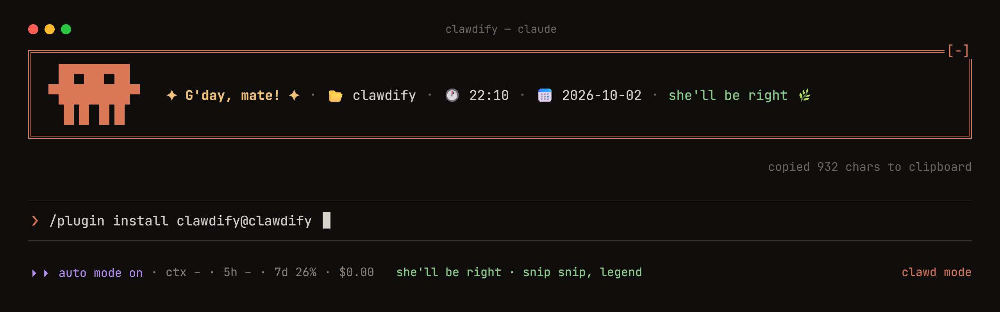

# clawdify 🦀



Restyle Claude Code from inside Claude Code. A [mod](https://claude.com/blog/claude-code-mods) that lets you change the spinner, the turn footer, the prompt hint, a banner above the prompt, the row under it, how transcript rows look, and Claude's persona. Use the `/clawdify` pane, the subcommands, or just say what you want:

```
/clawdify make it feel like a submarine
/clawdify green hacker footer, hide the startup notices
```

## Install

Needs a Claude Code build with mods (2.1.287 or later).

```
/plugin marketplace add viik2k/clawdify
/plugin install clawdify@clawdify
```

Or run it from a clone: `claude --plugin-dir path/to/clawdify`.

## Use

| Command | What it does |
|---|---|
| `/clawdify` | Open the editor pane (keys 1–7 switch tabs) |
| `/clawdify <anything>` | Describe what you want; Claude picks the settings |
| `/clawdify get` | List what you changed |
| `/clawdify set <key> <value>` | Change one setting (empty value = default) |
| `/clawdify preset <name>` | Layer a preset on top: `clawd`, `pirate`, `hacker`, `zen`, `minimal` |
| `/clawdify reset [key]` | Back to Claude Code defaults |
| `/clawdify export` / `import <json>` | Share settings as JSON |
| `/clawdify reload` | Pick up edits made to the saved settings file |

Settings persist across sessions and `/clear`. Empty means Claude Code's own behaviour, so nothing changes until you set something.

They're saved as the `settings` object in `~/.claude/plugins/store/clawdify_*.json`. Once you've set something, Claude knows that file: ask it for a tweak and it edits the file, then asks you to run `/clawdify reload`.

## Settings

| Tab | Keys |
|---|---|
| spinner | `spinnerVerbs`, `spinnerThinking`, `spinnerTools`, `spinnerResponding`, `spinnerSuffix` |
| turn | `doneVerbs`, `doneTemplate`, `doneColor`, `doneToastSecs` |
| prompt | `footer` (your own row under the prompt), `footerColor`, `hint`, `hintTail`, `modeLabel`, `backgroundHint` (`none` hides it) |
| banner | `banner`, `bannerColor`, `bannerBorder`, `bannerAlign`, `mascot` (`still` or `animated` Clawd, or a stock loop), `mascotColor` |
| transcript | `userPrefix`, `userColor`, `replyRewrites`, `expandToolGroups`, `hideNotices` |
| persona | `persona` (added to Claude's system prompt) |

- Lists are comma-separated: `Clawing, Scuttling, Pinching`.
- Stock Clawd loops for `mascot`: `scuttle`, `hop`, `wave`, `cheer`, `think`, `snooze`, `peek`, `idle`. The loop plays while Claude works; idle, Clawd blinks and glances about.
- Clawd stays above the prompt (`mascot`). Want him elsewhere? `{clawd}` is a one-row Clawd (▐▛███▜▌), animated in `spinnerSuffix`; the footer never draws him.
- Templates take `{model}`, `{cwd}`, `{path}`, `{time}`, `{date}`; `doneTemplate` also takes `{word}`, and its `{time}` is the turn's length.
- `footer` also takes `{branch}`, `{context}`, `{ctxbar}`, `{5h}`, `{7d}`, `{cost}`; split it with ` · ` and percentages turn amber past 60 and rust past 85.
- Colours are names (`green`, `magenta`) or `#rrggbb`. An unknown colour makes Claude Code draw that element normally.
- `replyRewrites` is display-only find/replace on Claude's replies: `you=>ye; /\bhello\b/gi=>ahoy`.

## Notes

- `/clawdify <anything>` makes one small Sonnet call on your account. Its answer is filtered to known settings before anything is saved.
- `persona` changes what Claude is told, not just how things look.

## Develop

```
claude plugin validate .
claude plugin test .
```

MIT licensed.
